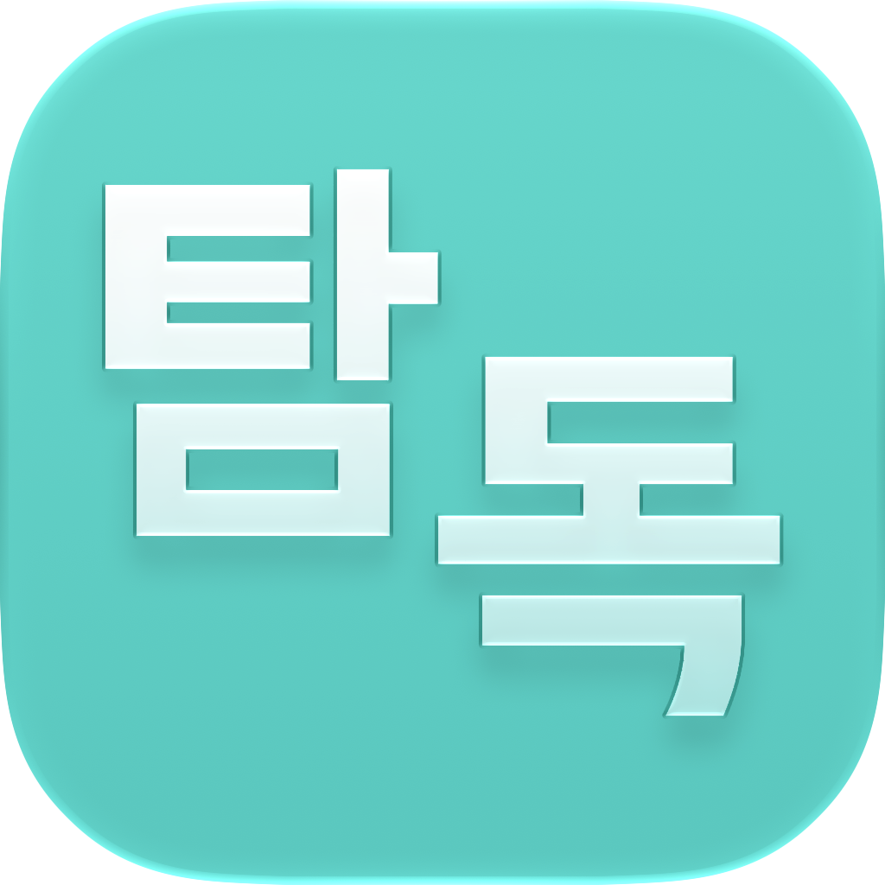

<p align="center">
  
</p>

<h1 align="center">Tamdok</h1>

<p align="center">
  <strong>An iOS manga reader built around JavaScript sources.</strong><br>
  Inspired by <a href="https://github.com/Aidoku/Aidoku">Aidoku</a> — with a different goal.
</p>

<p align="center">
  
  
  
  
</p>

---

**탐독 (Tamdok)** — *to devour a book.* A reader for people who want catalogs, libraries, and chapters in one place, and for people who want to write those catalogs in JavaScript.

## Why Tamdok exists

[Aidoku](https://github.com/Aidoku/Aidoku) is an excellent manga reader. Tamdok is openly inspired by it: the library, source lists, chapter reader, and the idea that extensions should be installable from a registry.

The **main goal is different**. Tamdok is built so sources are **JavaScript modules** (`.tamdok`) — easy to write, easy to share, easy to iterate on without a Rust/WASM toolchain. That is the product, not a side feature.

Aidoku `.aix` packages are supported as a compatibility layer so you can try community WASM sources. That layer is **best-effort**. It is not a drop-in Aidoku clone, and it will never be the reason this app exists.

## Sources

| Format | Role | Reality |
| --- | --- | --- |
| **`.tamdok`** | First-class JavaScript parsers | This is what Tamdok is for. Write `index.js`, ship `source.json`, install from a registry. |
| **`.aix`** | Aidoku WASM compatibility | Optional. Many sources work; many will not. No 100% guarantee. |

### JavaScript parsers (`.tamdok`)

A Tamdok source is a zip with:

- `source.json` — id, name, version, listings
- `index.js` — `getSearchMangaList`, `getMangaUpdate`, `getPageList`, optional `getHome` / `getListings` / `getFilters`
- optional `filters.json`, `icon.png`

The runtime gives you `request` (GET/POST/fetch with HTML/JSON helpers) and `defaults` for settings. Docs live in the community sources repo:

- [How to write Tamdok JavaScript sources](https://github.com/Tamdok-MangaReader/sources-community/wiki)
- [Official sources](https://github.com/Tamdok-MangaReader/sources)
- [Community sources](https://github.com/Tamdok-MangaReader/sources-community)

Default registry: `https://tamdok-mangareader.github.io/sources/index.min.json`

### Aidoku parsers (`.aix`)

Tamdok can install Aidoku source lists and `.aix` packages (WASM + `source.json`). A host in the app runs those modules so existing Aidoku catalogs are not a hard wall.

**Use Aidoku if you care about Aidoku sources.** Tamdok does not promise complete Aidoku API coverage, identical networking, or that a given `.aix` will keep working after site or source updates. If a WASM source is broken here and works in Aidoku, that is expected — file an issue only if you want the compatibility layer improved, not as a support contract.

For Aidoku itself: [Aidoku](https://github.com/Aidoku/Aidoku) and [Aidoku sources](https://github.com/Aidoku/sources).

## Features

- **Library** with categories, unread badges, and pull-to-refresh
- **Sources** from registries — browse home layouts, listings, search, and filters
- **Reader** — paged, RTL, webtoon/continuous, crop, pillarbox, progress
- **History** with swipe-to-delete and bulk clear (today / week / all)
- **Downloads** and **backups** (including iCloud where available)
- **Incognito** — reading history and read marks stay off
- **Appearance** — system / light / dark, accent color, alternate app icons
- **Locales** — English and Russian

## Philosophy

Tamdok should feel like a native iOS reader: large titles, glass, haptics, and the system stack. Under that, the interesting part is the parser runtime.

If you are choosing an app:

- Want **JavaScript sources** you can author and debug quickly → Tamdok
- Want **Aidoku’s WASM ecosystem** as the primary catalog → [Aidoku](https://github.com/Aidoku/Aidoku)
- Want both → Tamdok can try `.aix`, with the caveats above

## Status

Early (`1.0`). iOS is the platform that is actually maintained. APIs, source packages, and UI will still move.

This app does not host manga. It talks to whatever catalogs you install. You are responsible for the sources you add and for following the sites’ terms and local law.

## Development

```bash
pnpm install
pnpm ios
```

Useful scripts:

| Command | What it does |
| --- | --- |
| `pnpm ios` | Build and run on a connected iOS device |
| `pnpm build:wasm-host` | Rebuild the Aidoku WASM host bundle |
| `pnpm lint` | Lint |

Requires a recent Xcode / iOS toolchain (the project targets a current iOS SDK).

## Related

| Project | Link |
| --- | --- |
| Tamdok org | [github.com/Tamdok-MangaReader](https://github.com/Tamdok-MangaReader) |
| Official JS sources | [Tamdok-MangaReader/sources](https://github.com/Tamdok-MangaReader/sources) |
| Community JS sources | [Tamdok-MangaReader/sources-community](https://github.com/Tamdok-MangaReader/sources-community) |
| Aidoku | [Aidoku/Aidoku](https://github.com/Aidoku/Aidoku) |

## License

[Apache License 2.0](LICENSE)

Aidoku is a separate project with its own license and authors. Tamdok is not affiliated with Aidoku; “inspired by” is not “compatible with.”

## Credits

Tamdok by [SolsticeLeaf](https://github.com/SolsticeLeaf) · [me@sleaf.dev](mailto:me@sleaf.dev)

Thanks to Aidoku for proving that a source-driven manga reader on iOS can feel this good.
